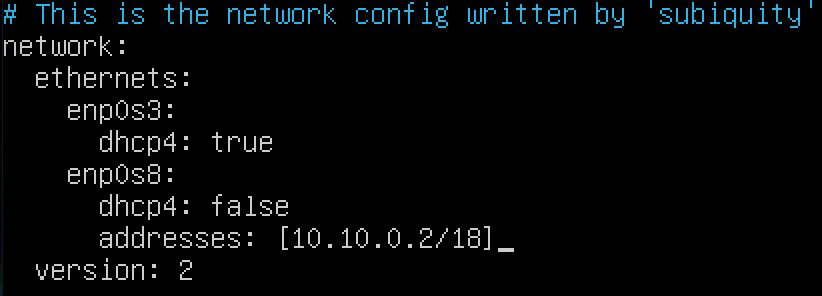
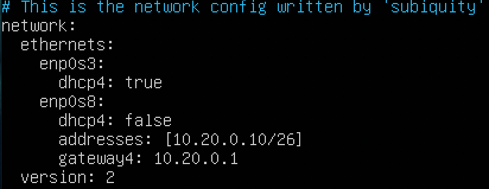

# LinuxNetwork


1. [Инструмент ipcalc](#part-1-инструмент-ipcalc) 
2. [Статическая маршрутизация между двумя машинами](#part-2-статическая-маршрутизация-между-двумя-машинами) 
3. [Утилита iperf3](#part-3-утилита-iperf3) 
4. [Сетевой экран](#part-4-сетевой-экран) 
5. [Статическая маршрутизация сети](#part-5-статическая-маршрутизация-сети) 
6. [Динамическая настройка IP с помощью DHCP](#part-6-динамическая-настройка-ip-с-помощью-dhcp) 
7. [NAT](#part-7-nat) 
8. [Допополнительно. Знакомство с SSH Tunnels](#part-8-дополнительно-знакомство-с-ssh-tunnels)


## Part 1. Инструмент **ipcalc**

### 1.1 Маски и сети

Адрес сети *192.167.38.54/13*:
- 192.168.0.0/13

Маска *255.255.255.0*: 
- Префиксная запись - /24 
- Двоичная запись - 111111111.111111111.111111111.00000000

Маска */15*:
- Обычная запись - 255.254.0.0 
- Двоичная запись - 111111111.11111111.00000000.00000000
 
Маска *11111111.11111111.11111111.11110000*:
- Обычная запись - 255.255.255.240
- Префиксная запись - /28

Минимальный и максимальный хост в сети *12.167.38.4* при маске */8*:
- HostMax - 12.0.0.1/8
- HostMax - 12.255.255.254/8

Минимальный и максимальный хост в сети *12.167.38.4* при маске  *11111111.11111111.00000000.00000000*:
- HostMax - 12.167.0.1/16
- HostMax - 12.167.255.254/16

Минимальный и максимальный хост в сети *12.167.38.4* при маске *255.255.254.0*:
- HostMax - 12.167.38.1/23
- HostMax - 12.167.39.254/23

Минимальный и максимальный хост в сети *12.167.38.4* при маске */4*:
- HostMax - 0.0.0.1/4
- HostMax - 15.255.255.254/4

***
<br>

### 1.2 localhost

Определить и записать в отчёт, можно ли обратиться к приложению, работающему на localhost, со следующими IP: *194.34.23.100*, *127.0.0.2*, *127.1.0.1*, *128.0.0.1*

localhost - 127.0.0.1/8
- HostMin - 127.0.0.1/8
- HostMax - 127.255.255.254

Следовательно, можно лишь обратиться к двум IP-адресам:
- 127.0.0.2
- 127.1.0.1

***
<br>

### 1.3 Диапазоны и сегменты сетей

Приватные сети:
 - 10.0.0.0/8 (то есть всё что начинается на 10.);
 - 172.16.0.0/12 (то есть с 172.16.0.0 по 172.31.255.255 включительно);
 - 192.168.0.0/16 (то есть со 192.168.0.0 по 192.168.255.255 включительно).

Слудовательно, частные ip-адреса:
- 10.0.0.45
- 192.168.4.2
- 172.20.250.4
- 172.16.255.255
- 10.10.10.10

И публичные ip-адреса:
- 134.43.0.2
- 172.0.2.1
- 192.172.0.1
- 172.68.0.2
- 192.169.168.1

Сеть 10.10.0.0/18:
- HostMin - 10.10.0.1
- HostMax - 10.10.63.254

Поэтому, в качестве default gateway могут быть адреса:
- 10.10.0.2
- 10.10.10.10
- 10.10.1.255

***
<br>

## Part 2. Статическая маршрутизация между двумя машинами

### Сетевые интерфейсы

#### Сетевые интерфейсы ws1:


#### Сетевые интерфейсы ws2:


***
<br>

### Настройка .yaml

#### Настройки ws1:


#### Настройки ws2:


#### Применение настроек на ws1:


#### Применение настроек на ws2:


***
<br>

### 2.1. Добавление статического маршрута вручную

#### Добавление статического маршрута на ws1:


#### Добавление статического маршрута на ws2:


#### Пинг с ws1 на ws2:


#### Пинг с ws2 на ws1:


***
<br>

### 2.2 Добавление статического маршрута с сохранением

#### Добавление статического маршрута в .yaml на ws1:


#### Добавление статического маршрута в .yaml на ws2:


#### Пинг с ws1 на ws2:


#### Пинг с ws2 на ws1:


***
<br>

## Part 3. Утилита **iperf3**

### 3.1 Скорость соединения
#### Перевод: 
- 8 Mbps - 1 MB/s
- 100 MB/s - 819 200 Kbps
- 1 Gbps - 1024 Mbps

### 3.2 Измерение скорости соединения между ws1 и ws2

#### Перевод ws1 в режим listening и измерение скорости


#### Подключение и отправка пакетов с ws2 на ws1


#### Скорость соединения - 3.66 Gbps
***
<br>

## Part 4. Сетевой экран

### 4.1. Утилита **iptables**

<br>

#### Правила для добавления в скрипт:
##### 1) на ws1 применить стратегию когда в начале пишется запрещающее правило, а в конце пишется разрешающее правило (это касается пунктов 4 и 5)
##### 2) на ws2 применить стратегию когда в начале пишется разрешающее правило, а в конце пишется запрещающее правило (это касается пунктов 4 и 5)
##### 3) открыть на машинах доступ для порта 22 (ssh) и порта 80 (http)
##### 4) запретить *echo reply* (машина не должна "пинговаться”, т.е. должна быть блокировка на OUTPUT)
##### 5) разрешить *echo reply* (машина должна "пинговаться")

<br>

#### Содержимое файла /etc/firewall.sh на ws1:


#### Содержимое файла /etc/firewall.sh на ws2:


#### Запуск скриптов на обеих машинах:


#### Пинг с ws1 на ws2:


#### Пинг с ws2 на ws1:


Применяемые правила iptables выполняются последовательно, поэтому с машины ws1 на ws2 отправляеются пакеты, а с ws2 на ws1 - нет.
***
<br>

### 4.2 Утилита **nmap**
#### Пинг ws2 на ws1 и вызов nmap:


#### Пинг ws1 на ws2 и вызов nmap:


#### Не пингующийся ws1 is up.
***
<br>

## Part 5. Статическая маршрутизация сети

### Топология сети:


### 5.1. Настройка адресов машин

#### Настройки компьютера ws11:




#### Настройки компьютера ws21:


#### Настройки компьютера ws22:


#### Настройки роутера r1:


#### Настройки роутера r2:


***
<br>

### Применение настроек и проверка

#### Настроенные интерфейсы ws11:


#### Настроенные интерфейсы ws21:


#### Настроенные интерфейсы ws22:


#### Настроенные интерфейсы r1:


#### Настроенные интерфейсы r2:


***
<br>

### Пинг устройств

#### С ws21 на ws22:


#### С ws11 на r1:


***
<br>

### 5.2. Включение переадресации IP-адресов.
### Временная переадресация на роутерах r1 и r2:

#### r1:


#### r2:


### Постоянная переадресация на роутерах r1 и r2:

#### r1:


#### r2:


***
<br>

### 5.3. Установка маршрута по-умолчанию
### Добавление DG на рабочих станциях
#### ws11: 


#### ws21: 



#### ws22: 


***
<br>

### Таблицы маршрутзиации на рабочих станциях

#### ws11: 


#### ws21: 


#### ws22: 


***
<br>

### Пинг устройств

#### С ws11 на r2:


#### Проверка на r2, что пакеты дошли:


***
<br>

### 5.4. Добавление статических маршрутов

### Добавление статических маршрутов в .yaml на роутерах

#### r1:


#### r2:


### Просмотр таблицы маршрутизации на роутерах

#### r1:


#### r2:


###  Просмотр маршрутов на ws11:


- Выбранный маршрут для сети 10.10.0.0/18 был выбран, так как статические маршурты имеют более высокие приоритет по сравнению с DG. Также, можно самим выставлять приоритет с помощью метрики.

#### 5.5. Построение списка маршрутизаторов

#### Запуск tcpdump на r1 c помощью команды:

``` shell
tcpdump -tnv -i enp0s9
```


#### Отслеживание маршрута от ws11 до ws22:


- Маршрут выбирается на основе таблицы маршрутизаторов. Если выбор произведен успешно, то пакет будет передан. Если выбор не удался, пакет не будет передан. В случае нескольких совпадений, будет выбран маршрут с наибольшей маской для переадресации.

*** 
<br>

### 5.6. Использование протокола **ICMP** при маршрутизации
#### Запускаю на r1 перехват сетевого трафика, проходящего через enp0s9 с помощью команды:

``` shell
tcpdump -n -i enp0s9 | grep 10.0.0.255
```
#### Пинг с ws11 несуществующий IP:

``` shell
ping -c 1 10.0.0.255
```


#### Вывод команды tcpdump:


## Part 6. Динамическая настройка IP с помощью **DHCP**

### Внесение изменение в файл dhcpd.conf на r2:


### Внесение изменение в файл resolv.conf на r2:


### Перезапускаю службу *isc-dhcp-server* на r2:


### Перезагрузка ws21 и ws22 и просмотр полученных ip-адресов:

#### ws21:


#### ws22:


### Пинг ws21 и ws22

#### ws21:


#### ws22:


***
<br>

### Содержимое файла .yaml на ws11:


### Внесение изменение в файл dhcpd.conf на r1:


### Внесение изменение в файл resolv.conf на r1:


### Перезапускаю службу *isc-dhcp-server* на r1:


### Перезапускаю ws11 и смотрю ip-адреса:


### Запрашиваю ip-адрес у dhcp-сервера:


## Part 7. **NAT**

### Установил на ws22 и r1 apache2 с помощью команды:

```shell 
    sudo apt install apache2
```

### Изменил файл ports.conf и запустил сервис
#### ws22:


#### r1:


***
<br>

### Cоздание файла firewall.sh и добавление правил:


### Пинг с ws22 на r1:


***
<br>

###  Добавление правила, разрешающее icmp:


### Пинг с ws22 на r1:


***
<br>

### Добавить в файл ещё два правила:
#### Включить **SNAT**, а именно маскирование всех локальных ip из локальной сети, находящейся за r2 
#### Включить **DNAT** на 8080 порт машины r2 и добавить к веб-серверу Apache, запущенному на ws22, доступ извне сети


### Запускать скрипта:


### Проверка соединения
#### по TCP для **SNAT**, c ws22 на r1:


#### по TCP для **DNAT**, c r1 на ws22:


## Part 8. Дополнительно. Знакомство с **SSH Tunnels**

### Запуск firewall.sh на r2:


### Запуск apache2 на ws22:


### Подключение по ssh с ws21 на ws22:


### Подключение по ssh с ws11 на ws22:


### Проверка подключения по telnet с ws21 на ws22:


### Проверка подключения по telnet с ws11 на ws22:


#### [Вернуться к оглавлению](#LinuxNetwork)